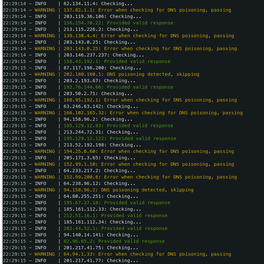

# DNS Validator

###### Forked from https://github.com/vortexau/dnsvalidator. This version is **much** *less* feature rich than the original. However, it doesn't look like the original is being maintained & there is a possibility that it will not return an output (see: https://github.com/vortexau/dnsvalidator/issues/27)

Filters a list of IPv4 DNS servers by verifying them against baseline servers, and ensuring accurate responses.

[](https://www.python.org/) [](https://www.gnu.org/licenses/gpl-3.0.en.html)

<p align="left"></p>

# Usage

| Argument      | Description                                                                                                  |
|---------------|--------------------------------------------------------------------------------------------------------------|
| -t  --threads | Specify the number of concurrent threads
| -i  --input   | Specify the file name containing Public DNS Servers
| -o  --output  | Specify the file name to save the validated DNS Servers

# Examples:

## CLI:

```bash
❯ python3 DNSValidator.py -t 24 -i nameservers.txt -o resolvers.txt
```

## Docker:

#### Pull the image
```bash
❯ docker pull frost19k/dnsvalidator
```

OR

#### Build it yourself
```bash
❯ git clone https://github.com/frost19k/dnsvalidator
❯ cd ./dnsvalidator
❯ docker buildx build -t dnsvalidator -f Dockerfile .
```

#### Run the container
```bash
❯ docker run -it --rm \
    -v "$(pwd)":"/output" \
    dnsvalidator -t 100 -o resolvers.txt
```

# Caveats

* **WARNING** Keep the thread count to a reasonable level and/or use a VPS/VPN appropriately. Pushing the thread count too high can make it look like you are attempting to attack DNS servers, resulting in network level DNS blocks from your ISP.
* Only IPv4 DNS Resolvers are validated at the current time. IPv6 resolvers are skipped.
