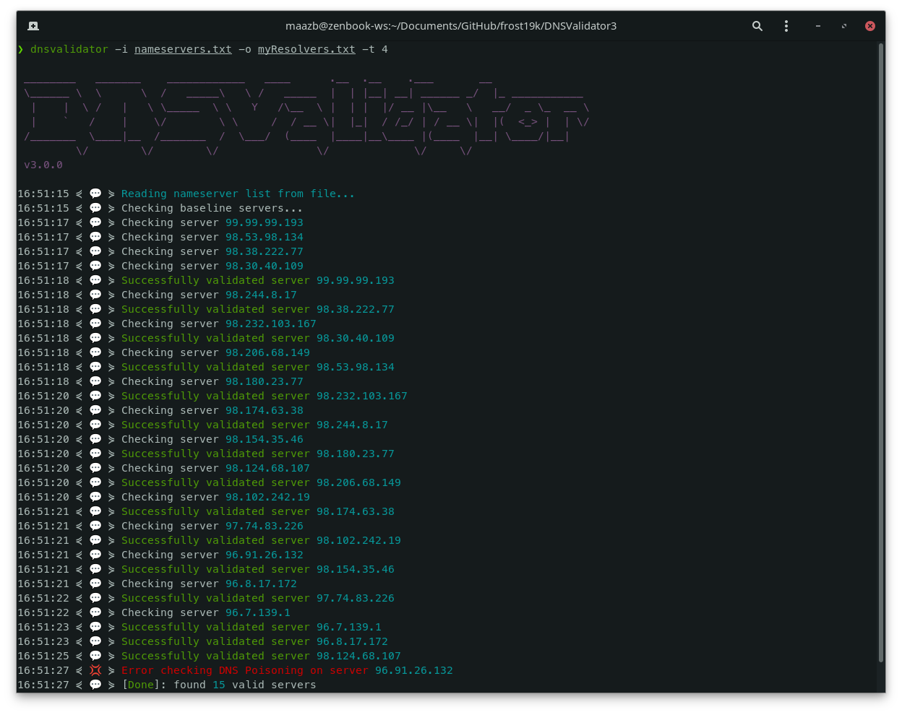

# DNSValidator 

[](https://www.gnu.org/licenses/gpl-3.0.en.html)
[](https://www.python.org/)

##### Forked from https://github.com/vortexau/dnsvalidator.
##### This version is **much** *less* feature rich than the original. However, it doesn't look like the original is being maintained & there is a possibility that it will not return an output (see: https://github.com/vortexau/dnsvalidator/issues/27)
<hr>
<br>

<a align="left"></a>

# Table of Contents:
1. [What does this do?](#about)
2. [How do I get it?](#setup)
    - [GitHub](#setup-github)
    - [Docker](#setup-docker)
3. [How do I use it?](#usage)
    - [CLI](#usage-cli)
    - [Docker](#usage-docker)
4. [You should know.](#caveats)

## What does this do? <a name="about"></a>

DNSValidator's approach is different to other DNS query validation tools. This tool performs multiple validation steps on each resolver:
- Baselines non-geolocated domain names against "trusted" public DNS resolvers i.e. `1.1.1.1` (Cloudflare), `8.8.8.8` (Google), and `9.9.9.9` (Quad9)
    - For each resolver being tested DNS Validator ensures that each baseline domain name resolves to the same IP Address.
    - Servers that return an answer that differs from the baseline are immediately skipped
- Performs DNS lookup of known commonly spoofed DNS addresses to ensure NXDOMAIN is returned when expected.
    - Resolvers that do not return NXDOMAIN for random subdomains of known bad target domains are immediately skipped.

## How do I get it? <a name="setup"></a>

### GitHub <a name="setup-github"></a>

```bash
❯ git clone https://github.com/frost19k/DNSValidator.git ./dnsvalidator
❯ cd ./dnsvalidator
❯ pip3 install .
```

### Docker <a name="setup-docker"></a>

#### Pull from Docker Hub
```Bash
❯ docker pull frost19k/dnsvalidator
```

#### Build it yourself

```bash
❯ git clone https://github.com/frost19k/DNSValidator.git ./dnsvalidator
❯ cd ./dnsvalidator
❯ docker buildx build -t dnsvalidator .
```

## How do I use it? <a name="usage"></a>

### CLI <a name="usage-cli"></a>

| Argument           | Description
|:--                 |:--
| -i, --input-file   | File containing Public DNS Servers (Default: [public-dns.info](https://public-dns.info/nameservers.txt))
| -o, --output-file  | Output file name (Default: "./resolvers.txt")
| -r, --root-domain  | Root domain to validate against (default: bet365.com)
| -t, --threads      | Number of concurrent threads (Default: 2)
| -v, --verbose      | Print additional error messages
| -q, --quiet        | Do not print banner or error messages

```Bash
❯ dnsvalidator -i nameservers.txt -o myResolvers.txt -t 12
```

### Docker <a name="usage-docker"></a>

```bash
❯ docker run -it --rm -v "${PWD}":"/output" frost19k/dnsvalidator -t 12
```

## You should know <a name="caveats"></a>

- Only IPv4 DNS Resolvers are validated at the current time. IPv6 resolvers are skipped.

- **WARNING:** Keep the thread count at a reasonable level and/or use a VPS/VPN appropriately. Pushing the thread count too high **will** give the impression that you are attempting to attack DNS servers, resulting in network level DNS blocks from your ISP.
